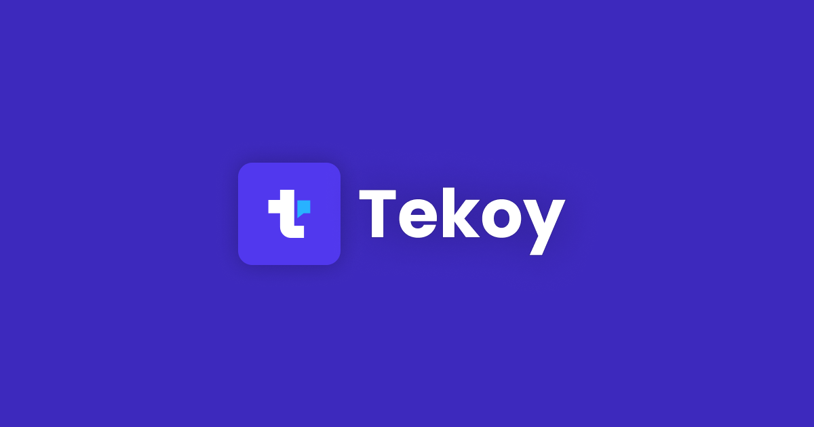
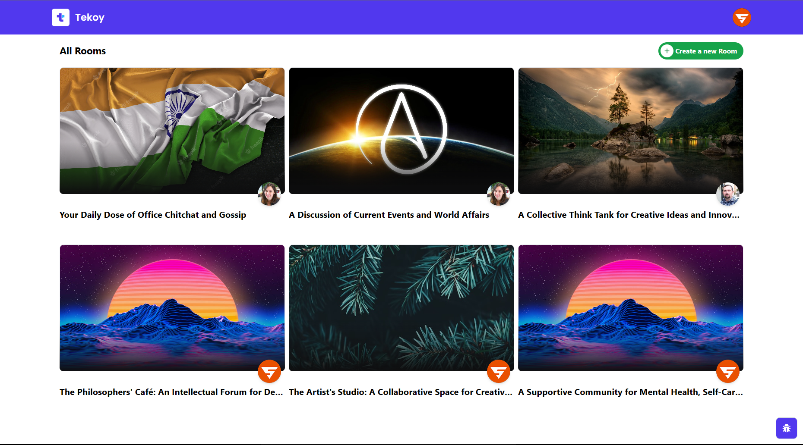
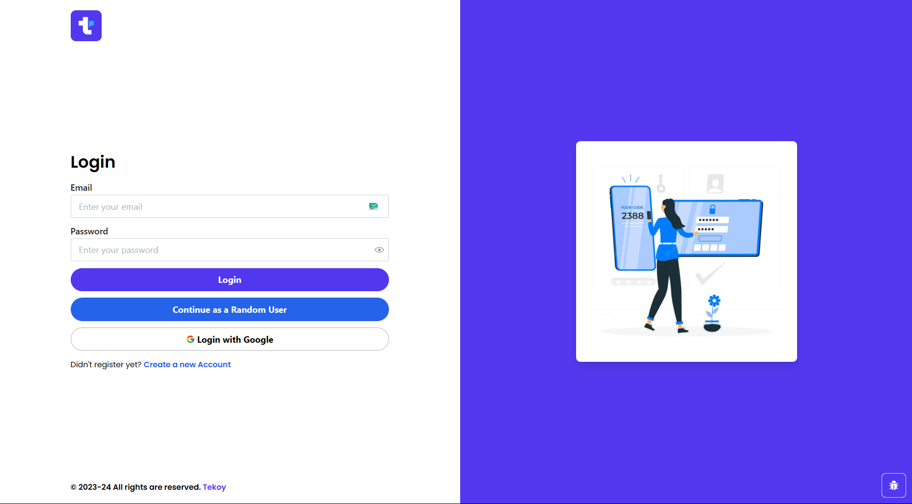
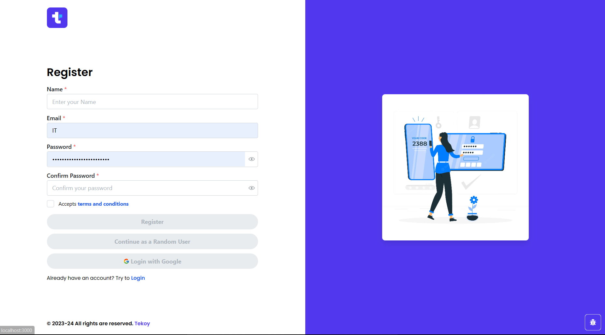
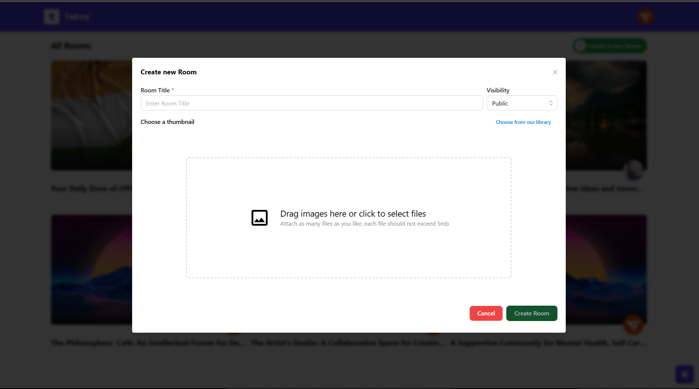
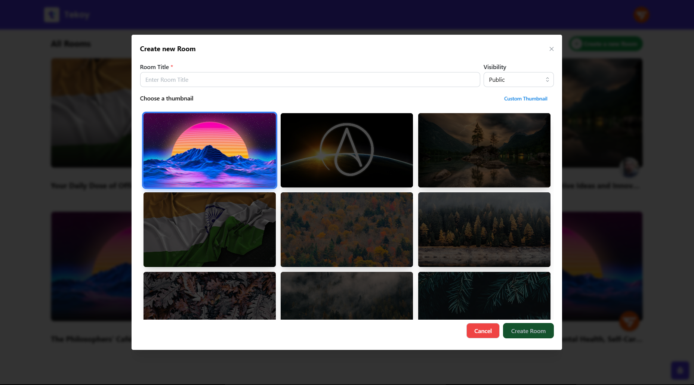
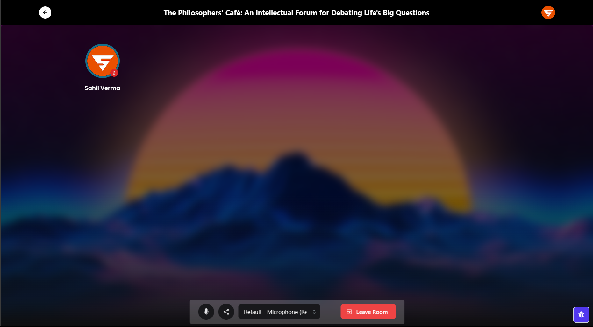
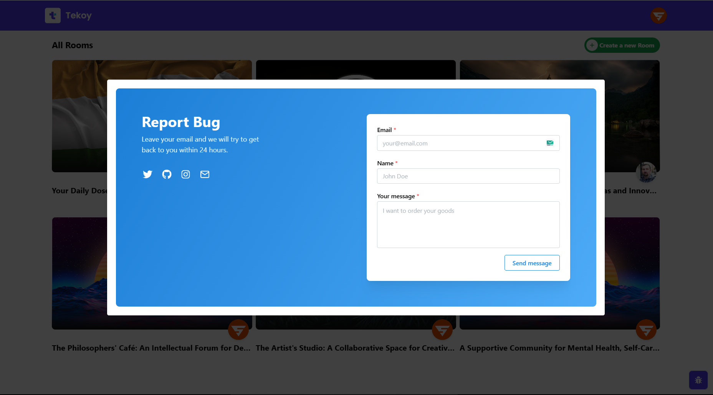

# Tekoy

This web application is a public group chat and discussion platform that draws inspiration from popular social media platforms like Twitter Space, Club House, Reddit Talk, and Discord Chat. Built using MERN (MongoDB, Express, React, Node.js) and written in Typescript, the app provides users with the ability to participate and host public or private chat rooms for real-time communication and collaboration. The UI is built using Mantine UI and Tailwind CSS, making it easy to use and accessible to a wide range of users. Users can join ongoing conversations and interact with one another through text, voice, and video, making it an ideal platform for group discussions on a variety of topics.

## Features

- Good looking UI and animation made with Tailwind CSS, Mantine UI and Framer Motion
- Multiple Authentication Options
- User can create room and discuss/talk with others.
- More Features are coming

## Live URL

http://tekoy.vercel.app/

## Screenshots

### Home

### Login

### Register

### Create Room With Custom Thumbnail

### Create Room with library images

### Room

### Report Bug

## Installation

### Frontend

1. Navigate to the `client` folder
2. Install the dependencies by running `npm install`
3. Create a `.env` file based on the `.env.example` file and set the appropriate environment variables
4. Start the development server by running `npm run dev`
5. The frontend will be available at `http://localhost:3000`

### Backend

1. Navigate to the `server` folder
2. Install the dependencies by running `npm install`
3. Create a `.env` file based on the `.env.example` file and set the appropriate environment variables
4. Start the server by running `npm run dev`
5. The backend will be available at `http://localhost:5000`

## Technologies

### Frontend

- React JS (Typescript)
- Mantine UI + Tailwind CSS
- Axios + React Query

### Backend

- Node JS
- Express JS
- Socket IO

### Database

- Mongo DB

### Development Tools

- VS Code
- ES Lint
- Prettier

## Contact

In case of any issues or for any other inquiries, please contact me at sahilverma.webdev@gmail.com
